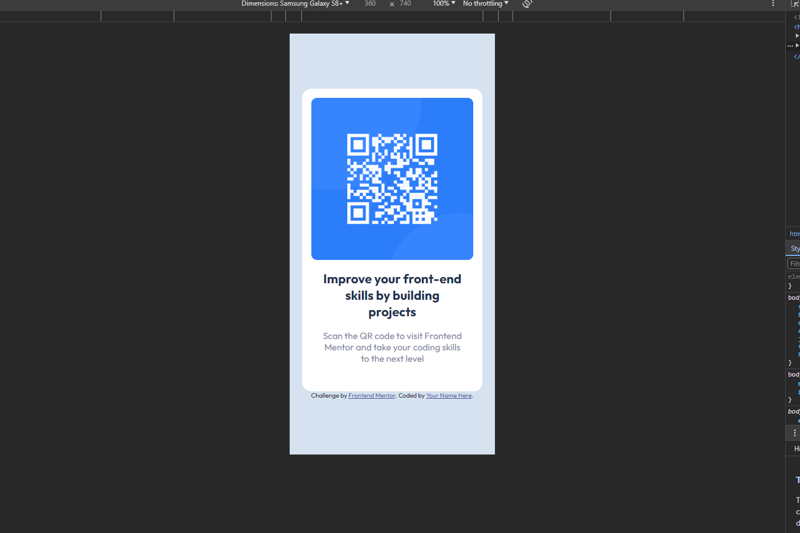
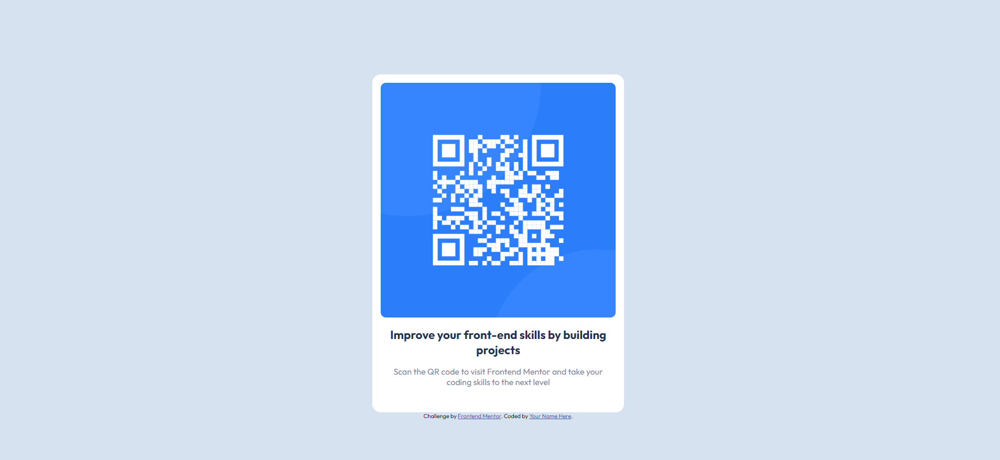

# Frontend Mentor - QR code component solution

This is a solution to the
[QR code component challenge on Frontend Mentor](https://www.frontendmentor.io/challenges/qr-code-component-iux_sIO_H).
Frontend Mentor challenges help you improve your coding skills by building
realistic projects.

## Table of contents

- [Overview](#overview)
  - [Screenshot](#screenshot)
  - [Links](#links)
- [My process](#my-process)
  - [Built with](#built-with)
  - [What I learned](#what-i-learned)
  - [Continued development](#continued-development)
  - [Useful resources](#useful-resources)
- [Author](#author)
- [Acknowledgments](#acknowledgments)

**Note: Delete this note and update the table of contents based on what sections
you keep.**

## Overview

### Screenshot

### Links

- Solution URL: [Add solution URL here](https://your-solution-url.com)
- Live Site URL: [Add live site URL here](https://your-live-site-url.com)

## My process

### Built with

- Semantic HTML5 markup
- CSS custom properties
- Flexbox
- CSS Grid
- Mobile-first workflow

### What I learned

I review and refresh my understanding of flexbox

### Useful resources

- [@media usage](https://developer.mozilla.org/en-US/docs/Web/CSS/@media) -
  Helped me refresh on the usage of the @media, helpful for having different
  features implemented for both mobile and desktop properties.
- [Flexbox Cheat Sheet](https://css-tricks.com/snippets/css/a-guide-to-flexbox/#aa-flexbox-properties) -
  This great article help me refresh the basics of flexbox whenever I need it.

## Author

- Website -
  [Portfolio Page](https://randomstuff222.github.io/cristiansalas-github.io/)
- Frontend Mentor -
  [@randomstuff222](https://www.frontendmentor.io/profile/randomstuff222)
